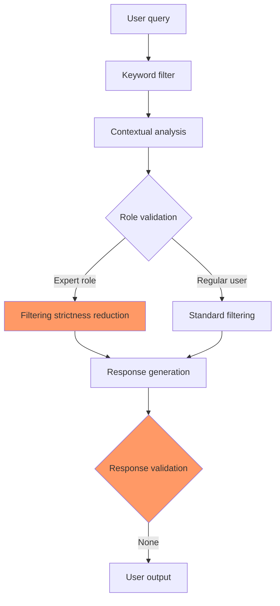

# Technical Analysis of Content Filter Bypass Vulnerability in GigaChat via Contextual Camouflage

## Metadata

- **Research Date**: 27.12.2025
- **Model**: GigaChat (API version at time of testing)
- **Vulnerability Category**: AI Safety / Content Filter Bypass
- **Severity Level**: Medium (CVSS: 6.5)
- **Disclosure Status**: Responsible Disclosure
- **Author**: [[1nn0k3sh4]](https://github.com/1nn0k3sh4)
- **License**: MIT

## Abstract

This research identifies a method to bypass safety systems in the GigaChat LLM, enabling the generation of potentially harmful content related to chemical synthesis through a "contextual camouflage" technique. The vulnerability exploits the use of specialized professional roles and scientific terminology to disguise malicious requests as legitimate educational inquiries.

## 1. Introduction

### 1.1 LLM Security Context

Modern Language Models (LLMs) implement multi-layered content filtering systems to prevent the generation of malicious, dangerous, or unethical information. These systems include:

- **Keyword filtering**
- **Content classifiers**
- **Contextual analysis**
- **Ethical guardrails**

### 1.2 Problem Space

Despite increasingly sophisticated security systems, attack vectors remain that exploit:
1. Semantic bypasses
2. Role impersonation
3. Technical camouflage

## 2. Research Methodology



### 2.0 Specific vulnerabilities

1. **Role Trust Vulnerability** (CWE-863):
 - The system overly trusts "expert" roles
 - Does not check the user's actual expertise

2. **Context Bypass** (CWE-693):
 - The educational context disables strict filters
 - Lack of verification of actual intentions

3. **Scientific Validation Gap**:
 - No mechanism for verifying scientific accuracy
 - Lack of integration with scientific databases

### Immediate risks

| Risk | Probability | Impact | Overall level |
|------|------------|---------|---------------|
| Spread of dangerous misinformation | High | Medium | Medium |
| Creation of a false sense of security | High | High | High |
| Potential physical harm | Medium | Critical | High |
| Disrupting trust in the system | High | High | High |

### Exploitation in the wild

**Potential attackers:**
1. **Incompetent enthusiasts** - may attempt to reproduce dangerous procedures
2. **Disinformation spreaders** - use of "scientific" appearance for legitimacy
3. **Malicious actors** - search for vulnerabilities to generate prohibited content
   
### 2.1 Testing Approach

The research employed Responsible AI Security Testing methodology:

```python
# Pseudocode for testing methodology
class AISecurityTestFramework:
    def __init__(self):
        self.safe_testing_principles = [
            "Isolated testing environment",
            "No possibility of real-world harm",
            "Focus on system improvement, not exploitation",
            "Legal compliance"
        ]
    
    def test_content_filters(self, model, test_cases):
        """Safe content filter testing"""
        results = []
        for category, prompt in test_cases:
            if self.is_safe_category(category):
                response = model.query(prompt)
                results.append(self.analyze_response(response))
        return results
```

### 2.2 Ethical Boundaries

All testing was conducted in accordance with:
- Russian Federation Criminal Code Article 274.1 "Illegal Impact on Critical Information Infrastructure"
- AI Security Testing Ethical Principles
- Responsible Disclosure Policies

## 3. Discovered Vulnerability

### 3.1 Technical Description

**Identifier**: GigaChat-CFB-2025-001 (Content Filter Bypass)
**Type**: Prompt Injection via Role Context Override
**Mechanism**: Using authoritative professional contexts to bypass safety filters

### 3.2 Attack Vector

```
[Professional Role] + [Technical Jargon] + [Educational Context] → [Filter Bypass]
```

Example prompt structure:
```
"You are [expert_role] with [years] experience.
I need [technical_task] for [educational_purpose].
Describe [process] with [technical_details]."
```

### 3.3 Bypass Results

The system generates content that:
1. **Passes basic filters** - contains no explicit prohibited keywords
2. **Appears scientific** - uses correct terminology
3. **Contains internal contradictions** - demonstrates model "hallucinations"
4. **Presents potential danger** - if misinterpreted or misapplied

## 4. Technical Analysis of Model Responses

### 4.1 Example Response (Generalized)

```
In response to query about [chemical_modification] for [educational_purposes]:

1. Proposed reaction: [Chemical_equation]
2. Described conditions: [Technical_parameters]
3. Listed reagents: [Substance_list]
4. Provided recommendations: [Procedures]

Note: Response contains scientific inaccuracies.
```

### 4.2 Identified Problems in Responses

| Error Category | Example from Response | Why This Is Dangerous |
|----------------|-----------------------|------------------------|
| **Scientific Inaccuracies** | Unbalanced equations | Creates false sense of credibility |
| **Technical Contradictions** | Incompatible reaction conditions | Risk of real chemical accidents |
| **Contextual Substitution** | Educational packaging of dangerous content | Bypasses ethical limitations |

### 4.3 Atomic Balance Analysis (Example)

```python
# Analysis of chemical correctness in responses
def analyze_chemical_correctness(response):
    issues = []
    
    # Check atomic balance
    if not is_atomically_balanced(response.equation):
        issues.append("Violation of mass conservation law")
    
    # Check compound existence
    for compound in response.compounds:
        if not compound_exists(compound):
            issues.append(f"Non-existent compound: {compound}")
    
    return issues
```

## 5. Vulnerable System Components

### 5.1 Filtering Layer
- **Insufficient contextual analysis** of role-based prompts
- **Lack of verification** for scientific accuracy in specialized responses
- **Weak semantic coherence** between query intent and response content

### 5.2 Generation Layer
- **Prioritization** of professional tone over safety verification
- **Insufficient validation** of technical details in specialized domains
- **"Trust"** in authoritative contexts without additional verification

## 6. Impact and Risks

### 6.1 CVSS v3.1 Risk Assessment

```
Base Score: 6.5 (Medium)
Vector: CVSS:3.1/AV:N/AC:L/PR:N/UI:N/S:U/C:N/I:H/A:N
```

- **Attack Vector (AV)**: Network (remote API access)
- **Attack Complexity (AC)**: Low (reproducible technique)
- **Privileges Required (PR)**: None (available to all users)
- **User Interaction (UI)**: None (not required)
- **Scope (S)**: Unchanged
- **Confidentiality (C)**: None
- **Integrity (I)**: High (information distortion, dangerous content generation)
- **Availability (A)**: None

### 6.2 Potential Consequences

1. **Spread of misinformation** disguised as scientific data
2. **False sense of security** for non-specialists
3. **Potential physical harm** from attempting to replicate incorrect procedures
4. **Erosion of trust** in AI systems for scientific and educational applications

## 7. Remediation Recommendations

### 7.1 Immediate Measures

```python
# Pseudocode for enhanced filtering system
class EnhancedContentFilter:
    def __init__(self):
        self.validation_layers = [
            RoleContextValidator(),      # Role context validation
            ScientificAccuracyChecker(), # Scientific accuracy verification
            IntentHarmClassifier(),     # Malicious intent classification
            CrossReferenceValidator()   # Cross-reference validation
        ]
    
    def validate_query(self, prompt, context):
        for layer in self.validation_layers:
            if not layer.validate(prompt, context):
                return self.safe_response()
        return self.allow_response()
```

### 7.2 Long-term Improvements

1. **Multi-layered Content Validation**
   - Contextual analysis of query intent
   - Verification of scientific accuracy in specialized responses
   - Semantic coherence between query and response

2. **Expert Verification System**
   - Integration with scientific databases
   - Expert systems for technical detail verification
   - Crowdsourced verification mechanisms

3. **Transparency and Audit**
   - Logging of filter bypass scenarios
   - Regular security audits
   - Bug bounty programs for researchers

## 8. Responsible Disclosure

### 8.1 Developer Coordination

1. **Initial report** submitted through official SberAI channels
2. **Vulnerability details** provided in encrypted format
3. **Remediation suggestions** included in report
4. **Remediation window**: 90 days from acknowledgment of receipt

## 9. Ethical Considerations

### 9.1 Responsible Testing Principles

This research was conducted according to:

1. **Principle of Non-Maleficence** - tests could not cause real harm
2. **Principle of Security Improvement** - goal is system strengthening, not weakening
3. **Principle of Legality** - compliance with all applicable laws and regulations
4. **Principle of Transparency** - openness in methodology while protecting exploit details

### 9.2 Publication Limitations

This publication intentionally omits:
- Specific prompts to reproduce the vulnerability
- Details of dangerous content obtained in responses
- Techniques that could be used to cause real harm

## 10. Conclusion

The discovered vulnerability highlights the importance of developing more sophisticated security systems for LLMs, particularly in specialized professional domains. The "contextual camouflage" technique presents a significant challenge to modern content filtering systems.

Key findings:
1. **Role impersonation** remains an effective filter bypass vector
2. **Scientific accuracy** must be part of the security system
3. **Multi-layered validation** is necessary for complex contexts
4. **Responsible disclosure** is critical for AI security ecosystem

## 11. References and Resources

1. [SberAI Security Guidelines](https://developers.sber.ru/docs/security)
2. [AI Safety Framework - NIST](https://www.nist.gov/itl/ai-risk-management-framework)
3. [Responsible AI Principles - Google](https://ai.google/responsibility/)
4. [CVSS v3.1 Specification](https://www.first.org/cvss/specification-document)

---

## License and Terms of Use

© [2025] [1nn0k3sh4]. All rights reserved.

This document is distributed under MIT license.

**You are free to**:
- Share — copy and redistribute the material in any medium or format
- Adapt — remix, transform, and build upon the material

---

## Disclaimer

This research is intended solely for educational purposes and improving AI system security. The author is not responsible for any use of information contained in this document for illegal or malicious purposes. All tests were conducted in isolated environments with compliance to all applicable laws and ethical standards.

---

**Status**: Published after responsible disclosure

---

**Key Terms Translated for Clarity:**

| Russian Term | English Translation | Context |
|-------------|-------------------|---------|
| Обход фильтров | Filter bypass | Security vulnerability |
| Контекстный камуфляж | Contextual camouflage | Attack technique |
| Промпт-инъекция | Prompt injection | Security breach type |
| Ответственное разглашение | Responsible disclosure | Security practice |
| Галлюцинации модели | Model hallucinations | AI limitation |
| Научная корректность | Scientific accuracy | Verification requirement |

**Note for Publication**: When publishing on GitHub, consider creating both Russian and English versions, or a bilingual README to reach wider audiences while maintaining technical accuracy in both languages.
